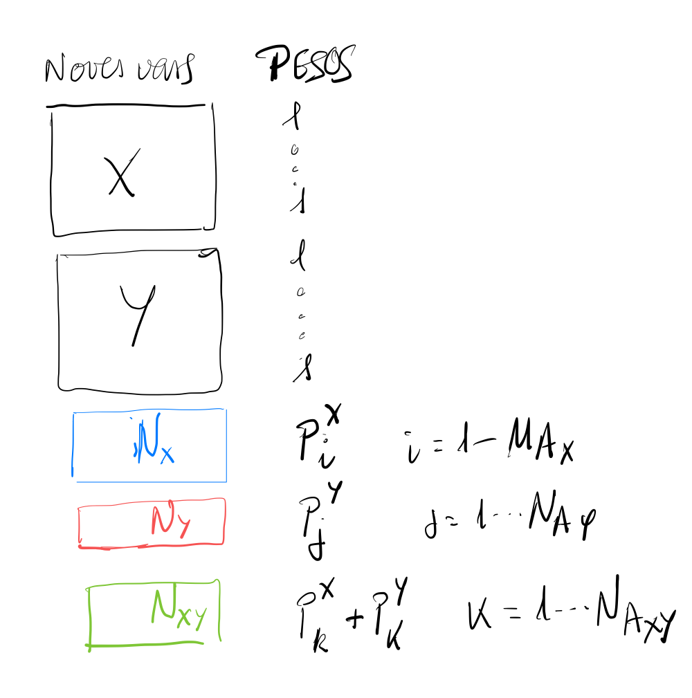

```{r setup, include=FALSE}
require(knitr)
knitr::opts_chunk$set(echo = TRUE, message = FALSE, warning = FALSE, comment = NA, prompt = TRUE, tidy = FALSE, fig.width = 7, fig.height = 7, fig_caption = TRUE,cache=FALSE)
Sys.setlocale("LC_TIME", "C")
```

```{r packages, include=FALSE}
# require(devtools)
# if(!require(installifnot)) install_github("uebvhir/installifnot")

library("bibtex")
```

# Work overview

-   Motivation

    -   Interpretability is one weak point of multi-omics
    -   Idea: COmbine numeric information with biological annotations in the analysis

-   Existing approaches

    -   Many dimension reduction and other techniques

    -   Only a few account for biological information

        -   MOFA, XXX?

-   Our proposal

    -   Multiple Factor Analysis

        -   Multiple groups of data of multiple types in a *natural* way

        -   Weights to variables/individuals which allows different approaches to including biological information.

        -   Emphasizes duality of approaches (space of variables/individuals) which allows distinct representations for biological annotations.

        -   Can deal with missing data in a

            -   for missing values at random
            -   for block-wise missing values

    -   Process automation in an easy-2-use

        -   pipeline using the `targets` R package
        -   shiny application

# Details of the methods

- Assume, for simplicity, we have 2 groups of variables, measured on the same group of individuals.
  - These are usually associated/categorized by one or more categorical variables (phenotypes).
  - The variables have their annotations that can be decomposed in those that are unique (red/blue) and those that are common (green)
  -   Annotations have usually been selected keeping only those that characterize the difference between phenotypes [See "Comments on the method \# 1"]

 some are common to both")

- Annotations datasets can be "numerized" by the following transformation [See "Comments on the method \# 2"]

$$
N_G = \phi(G, A_G) , \quad G\in {X, Y, ...},
$$

where:

$$
N_X = \frac 1{r_X} (X' \times A_X), 
$$
$$
N_Y = \frac 1{r_Y} (Y' \times A_Y), 
$$

and $N_{XY}$ is computed similarly, first evaluating it in X, then in Y and the computing a weighted average, where the weights are chosen *wisely*, for example in the same way as datasts are combined in MFA.

Each numerical new variable is given a weight which equals the number of expression variables annotated in the category that has generated it.



This provides some flexibility for the analysis

- Take $X$, $Y$ as active datasets and $N_X$, $N_Y$, $N_{XY}$ as supplementary

- Take $X$, $Y$ and $N_{XY}$ as active and the others as supplementary

- Take all datsests as active

- DO a dual analysis so that annotations can be kept as categorical

## Comments on the approach taken 

### Selecting the annotations

The selection of which annotations should be used deserves some attention.

- A natural approach is to do a gene enrichment analysis or a GSEA on each dataset and select the significant annotations.
- This can be refined if we do a goProfiles or goSorensen comparison of the gene lists in order to try to reduce the number of annotations.

### Similar approaches

Tayrac et alt (2011) did a similar analysis, but they have not continued working on this approach. **How different is our approach from theirs?**

# Example

- The first analysis illustrates how MFA is used to integrate and visualize biological information

# How does adding annotations improve integrative analyisis?

- It (may) hel interpretability, even if no more (inertia) explained
- It may explain more inertia and provide better separation of groups.

_How do we measure the improvement?_


# Implementation

- A `targets` based analysis pipeline.


# Discussion

- Comparison with other approaches
- Pro's and con's

