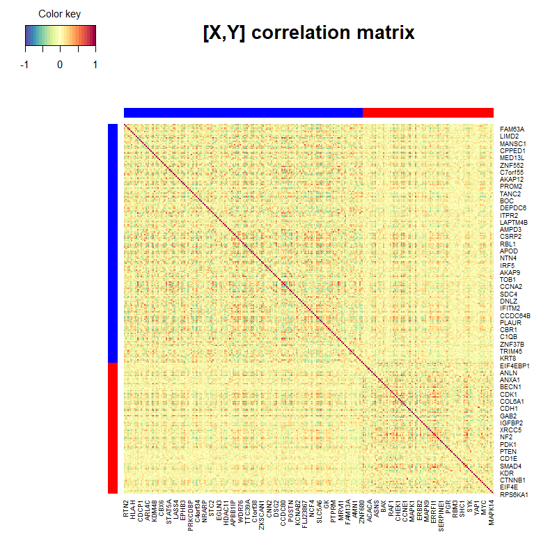

Targets' report corresponding to the functions that execute de Mixomics part of the IODA pipeline...

```{r libraries, include=FALSE, echo=FALSE}
library(ggplot2)
library(targets)
library(stats)
library(mixOmics)

```

```{r set-options, echo=FALSE, cache=FALSE}
options(width = 110)
```

## Raw data (before data prep) 

Data loaded from file **`r p.inFile`**
(Features in rows; Samples in columns)

```{r out.width = '95%', echo=FALSE}
tar_read(gene_data)[1:10,1:8]
tar_read(prot_data)[1:10,1:8]
```

```{r out.width = '95%', echo=FALSE}
hist(gene_data)
hist(prot_data)
```

## Data after scaling

(Features in rows; Samples in columns)

```{r out.width = '95%', echo=FALSE}
tar_read(gene_sc)[1:10,1:8]
tar_read(prot_sc)[1:10,1:8]
```

```{r out.width = '95%', echo=FALSE}
hist(gene_sc)
hist(prot_sc)
```

## Correlation matrix

```{r corr-plot, out.width = '95%'}
require(mixOmics)
plot_corr_matrix(tar_read(X), tar_read(Y), p.resultsDir)
```


## rCCA results

```{r rCCA-results, out.width = '95%'}
tar_read(rCCA)
```

### Individual samples plot
```{r indiv-plot, out.width = '95%'}
require(mixOmics)
plot_indiv(tar_read(rCCA), p.resultsDir)
```


### Correlation circles plots
Correlation circles plots (at **cutoff points: `r p.cutOffs`**)

```{r corrCirc-plot, out.width = '80%'}
require(mixOmics)
for(i in 1:length(p.cutOffs)){
  plot_corrCirc(tar_read(rCCA), p.resultsDir, cutOff = p.cutOffs[i])
}
```


